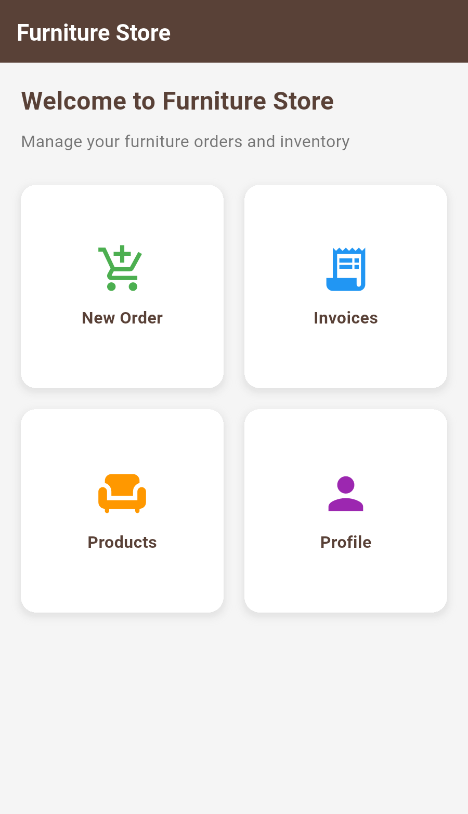
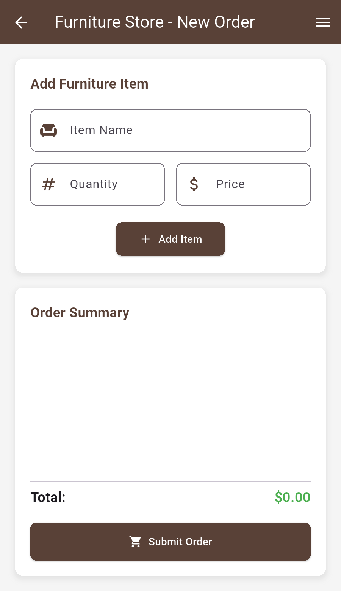
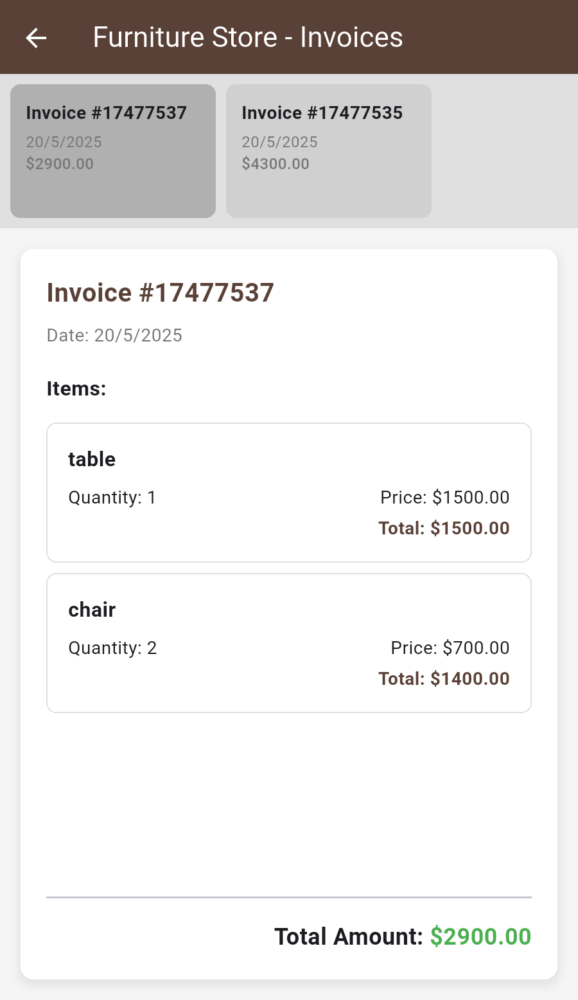
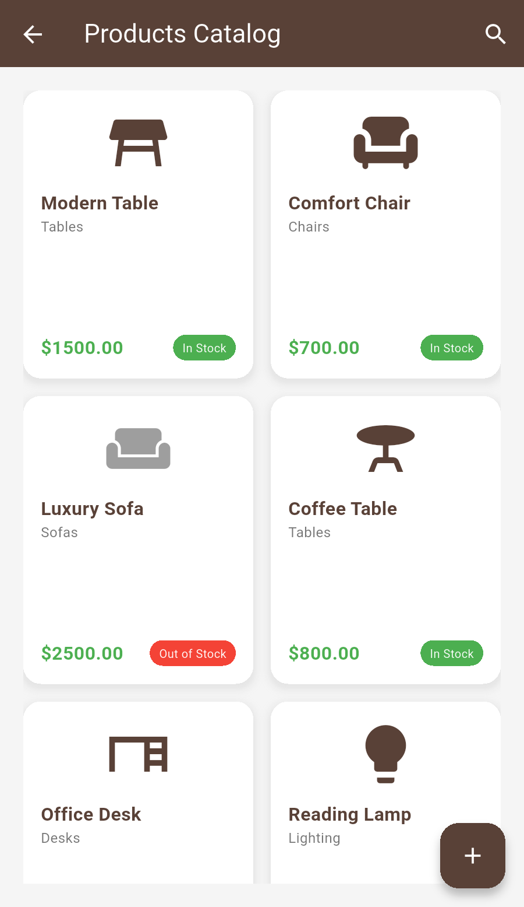
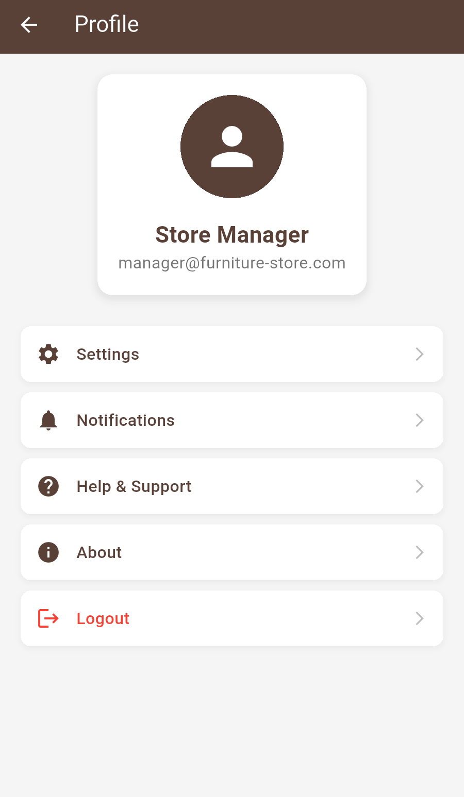

# 🛋️ Furniture Store App

> A modern, responsive furniture store management application built with Flutter for seamless inventory and order management.

<div align="center">

[](https://flutter.dev)
[](https://dart.dev)
[](https://flutter.dev)

[](LICENSE)
[](https://github.com/Zeyad-GenAI/Furniture_App)
[](https://github.com/Zeyad-GenAI/Furniture_App/releases)


</div>

## 📋 Overview

Furniture Store App is a comprehensive mobile application designed for furniture store management. It provides an intuitive interface for managing orders, viewing invoices, browsing products, and handling customer profiles. The app features a modern design with responsive layouts that adapt beautifully to different screen sizes.

## ✨ Key Features

- 🏠 **Modern Home Dashboard** - Clean and intuitive navigation interface
- 🛒 **Order Management** - Create and manage furniture orders with real-time calculations
- 📄 **Invoice System** - Professional invoice display with detailed item breakdowns
- 🪑 **Product Catalog** - Browse furniture items with categories and stock status
- 👤 **User Profile** - Manage user settings and preferences
- 📱 **Responsive Design** - Adaptive layouts for tablets and phones
- 🎨 **Beautiful UI** - Modern design with smooth animations and transitions
- ⚡ **Real-time Updates** - Dynamic content updates without page refresh

---

## 📱 Screenshots

> Add your app screenshots here to showcase the user interface

| Home Screen | Order Management | Invoice Display |
|------------|----------------|-------------|
|  |  |  |

| Product Catalog | Profile Screen |
|------------|------------|
|  |  |

---

## 🎬 Animations & User Experience

The app includes several delightful animations and interactions:

- **Smooth Transitions** - Page navigation with fluid animations
- **Card Hover Effects** - Interactive product and menu cards
- **Loading States** - Elegant loading indicators for better UX
- **Responsive Grid** - Dynamic layout adjustments based on screen size
- **Touch Feedback** - Visual feedback for all interactive elements

## 🛠️ Tech Stack

| Technology | Purpose |
|------------|---------|
| **Flutter** | Cross-platform mobile framework |
| **Dart** | Programming language |
| **Material Design** | UI component library |
| **Custom Models** | Data structure management |

### Dependencies
```yaml
dependencies:
  flutter:
    sdk: flutter
  cupertino_icons: ^1.0.8

dev_dependencies:
  flutter_test:
    sdk: flutter
  flutter_lints: ^5.0.0
```

## 🚀 Getting Started

### Prerequisites
- Flutter SDK (version 3.0 or higher)
- Android Studio / VS Code
- Android/iOS device or emulator

### Installation

1. **Clone the repository**
   ```bash
   git clone https://github.com/Zeyad-GenAI/Furniture_App.git
   cd Furniture_App
   ```

2. **Install dependencies**
   ```bash
   flutter pub get
   ```

3. **Run the application**
   ```bash
   flutter run
   ```

### Build for Production

```bash
# Android APK
flutter build apk --release

# iOS
flutter build ios --release
```

## 📁 Project Structure

```
lib/
├── models/
│   ├── furniture_item.dart     # Furniture item data model
│   └── invoice.dart           # Invoice data model
├── screens/
│   ├── home_screen.dart       # Main dashboard
│   ├── new_order_screen.dart  # Order creation
│   ├── invoices_screen.dart   # Invoice management
│   ├── products_screen.dart   # Product catalog
│   └── profile_screen.dart    # User profile
└── main.dart                  # App entry point
```

## 🎯 Features in Detail

### 🏠 Home Dashboard
- Grid-based navigation with colorful icons
- Quick access to all major features
- Modern card-based design with shadows

### 🛒 Order Management
- Add items with name, quantity, and price
- Real-time total calculation
- Item removal functionality
- Order submission with success feedback

### 📄 Invoice System
- Responsive layout (list/grid view)
- Detailed item breakdown
- Professional formatting
- Date and total amount display

### 🪑 Product Catalog
- Grid view of available products
- Stock status indicators
- Category-based organization
- Search functionality (placeholder)

### 👤 Profile Management
- User information display
- Settings and preferences
- Logout functionality
- Clean list-based interface

## 🤝 Contributing

We welcome contributions! Here's how you can help:

1. **Fork the repository**
2. **Create a feature branch** (`git checkout -b feature/AmazingFeature`)
3. **Commit your changes** (`git commit -m 'Add some AmazingFeature'`)
4. **Push to the branch** (`git push origin feature/AmazingFeature`)
5. **Open a Pull Request**

### Development Guidelines
- Follow Flutter best practices
- Maintain consistent code formatting
- Add comments for complex logic
- Test on multiple screen sizes

## 🐛 Bug Reports & Feature Requests

Found a bug or have a feature idea? Please [open an issue](https://github.com/Zeyad-GenAI/Furniture_App/issues) with:
- Clear description of the issue/feature
- Steps to reproduce (for bugs)
- Screenshots if applicable
- Device/OS information

## 📱 Compatibility

- **iOS**: 11.0+
- **Android**: API level 21+
- **Flutter**: 3.0+

## 🔮 Future Enhancements

- [ ] 🔍 Advanced search and filtering
- [ ] 🌐 Backend integration with REST API
- [ ] 📊 Analytics dashboard
- [ ] 🔔 Push notifications
- [ ] 🎨 Dark mode support
- [ ] 🌍 Multi-language support
- [ ] 💳 Payment integration
- [ ] 📷 Image upload for products

## 👥 Team

- **Developer**: [Zeyad ElFaramawy](https://github.com/Zeyad-GenAI)
- **Designer**: [Zeyad ElFaramawy](https://github.com/Zeyad-GenAI)

## 📜 License

This project is licensed under the MIT License - see the [LICENSE](LICENSE) file for details.

```
MIT License

Copyright (c) 2025 Furniture Store App

Permission is hereby granted, free of charge, to any person obtaining a copy
of this software and associated documentation files (the "Software"), to deal
in the Software without restriction, including without limitation the rights
to use, copy, modify, merge, publish, distribute, sublicense, and/or sell
copies of the Software...
```

## 🌟 Support

If you found this project helpful, please give it a ⭐ on GitHub!

---

<p align="center">
  Made with ❤️ using Flutter
</p>

<p align="center">
  <a href="#top">⬆️ Back to Top</a>
</p>
